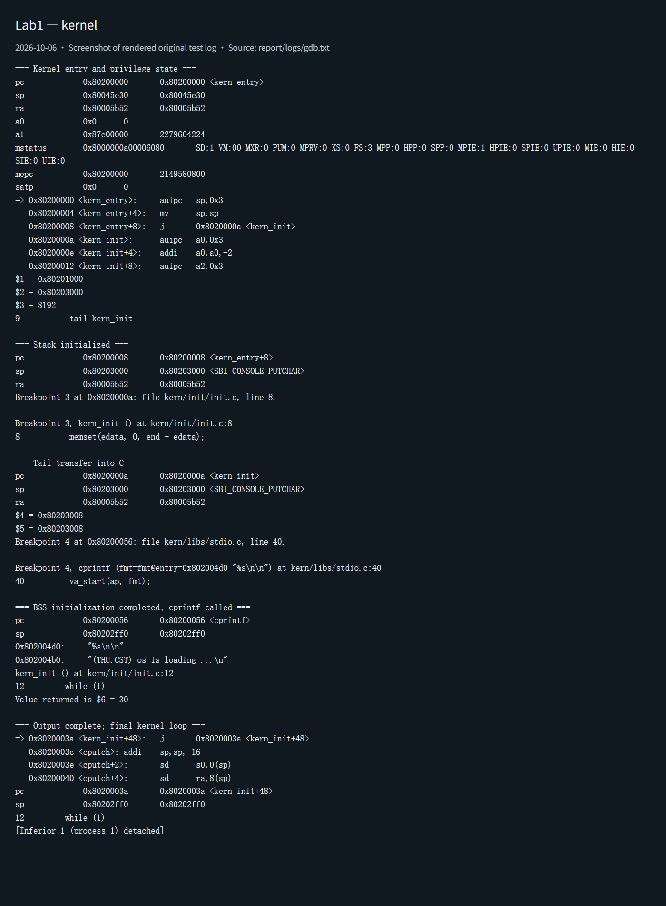

# 操作系统实验报告

## 实验基本信息

| 项目 | 内容 |
|------|------|
| **实验名称** | Lab 1: 最小可执行内核与启动流程 |
| **小组成员** | 2412303-袁煜杰、2413625-张龙飞、2413357-王逸凌 |
| **完成日期** | 2026-10-06 |

### 小组分工

| 成员 | 负责的练习/模块 |
|------|----------------|
| 2412303-袁煜杰 | 报告初版制作，练习验证补充 |
| 2413625-张龙飞 | 练习完成以及细节处理与补充 |
| 2413357-王逸凌 | 定稿并且润色报告 |

---

## 一、实验目的

本实验的主要目的是：

1. 理解链接脚本、内存布局和交叉编译，构建最小可执行内核。
2. 理解 QEMU、OpenSBI 与内核之间的启动流程，掌握栈初始化和入口跳转的作用。
3. 使用 GDB 验证从复位到内核入口的执行过程，并通过 SBI 实现格式化输出。

---

## 二、实验环境

使用的 AI 工具

| 成员 | AI 编程工具 | 底层模型 | 备注 |
|------|------------|---------|------|
| 2412303-袁煜杰 | Codex | GPT-6.1 Sol Medium  | 无 |
| 2413625-张龙飞 | opencode | Kimi-K3 | 无 |
| 2413357-王逸凌 | 暂无 | 暂无 | 无 |

**说明：**

- **AI 编程工具**：指具体使用的终端工具、编辑器插件、桌面应用或浏览器界面
- **底层模型**：指该工具使用的大语言模型及版本

---

## 三、实验整体逻辑分析

### 2.1 本章节的逻辑主线

本章围绕最小内核的构建与启动展开，解决如何让 RISC-V 内核在 QEMU 中执行并输出信息的问题。通过链接脚本确定内核布局，交叉编译生成镜像，再由复位跳板和 OpenSBI 将控制权交给内核。内核初始化栈和 BSS，通过 SBI 输出字符串，最后进入死循环。

### 2.2 功能的逐步实现

1. 首先确定**内存布局和入口地址**：链接脚本将入口 `kern_entry` 放在 `0x80200000`，使链接地址与镜像加载地址一致。
2. 接着完成**编译与镜像生成**：将 C 和汇编源文件编译为目标文件，链接生成 ELF，再用 `objcopy` 生成裸镜像。
3. 然后完成**启动与内核初始化**：CPU 从 `0x1000` 进入复位跳板，跳转至 `0x80000000` 的 OpenSBI，再进入内核；入口汇编设置栈指针，尾跳转到 `kern_init`。
4. 最后完成**格式化输出和调试验证**：`kern_init` 清零 BSS，调用 `cprintf`，通过 SBI 输出启动信息；使用 GDB 核对入口、栈和循环状态。

---

## 四、实验内容与实现

### 功能模块：最小内核启动与调试验证

**负责人：** 2412303-袁煜杰、2413625-张龙飞、2413357-王逸凌 

本次lab1并未修改实现；实际修改 Makefile 的启动与调试目标，新增 GDB 和自动验证脚本。最终在各个小组成员的机器上已经复现。

**功能说明：**

`tools/kernel.ld` 确定入口和段布局，Makefile 完成构建。`kern_entry` 设置启动栈并进入 `kern_init`；`kern_init` 使用 `memset` 初始化 BSS，通过 `cprintf` 输出后进入死循环。输出链为 `cprintf → vcprintf → vprintfmt → cputch → cons_putc → sbi_console_putchar → sbi_call`，其中 `ecall` 请求 OpenSBI 服务。GDB 脚本验证入口地址、栈指针、尾跳转和循环，自动脚本保存构建与运行日志。

#### 实现迭代过程

完成环境准备和原始代码编译后，根据启动与调试中出现的实际问题进行修改，过程如下：

---

##### 第一次迭代：修复启动兼容问题

**遇到的问题：**

- 原始代码编译通过，但运行后只有 OpenSBI 信息，没有内核输出；日志显示下一阶段地址为 0。
- Makefile 写死了 GDB 工具名称，不能直接使用已安装的 `gdb-multiarch`。

**问题解决策略：**

- 结合日志和 AI 分析，将启动参数改为 `-kernel $(UCOREIMG)`。
- 使 GDB 工具可配置，通过 `make gdb GDB=gdb-multiarch` 连接调试。

**最终结果：**

内核成功启动并打印信息，GDB 能连接 QEMU 并停在内核入口。

---

##### 第二次迭代：完善调试验证

**遇到的问题：**

- 补充检查时，将固件入口断言误放到最终循环处，导致调试脚本报错。
- 复位暂停时镜像已经加载，写监视点不能捕捉之前的加载过程。

**问题解决策略：**

- 根据报错位置删除错误断言，重新运行验证。
- 在内核入口设置断点，检查栈指针和跳转情况，并对照镜像确认内存内容。

**最终结果：**

完成上述修改后：

- 编译通过
- 启动和 GDB 验证通过
- 内核输出及死循环符合预期

**关键改进点总结：**

1. 根据实际日志调整配置。
2. 核对 AI 给出的修改，并重新运行测试确认结果。

---

### 练习：理解内核启动中的程序入口操作

**负责人：** 2413625-张龙飞，2412303-袁煜杰

`kern/init/entry.S` 定义了内核执行的第一条指令，其正文只有两条：

```asm
kern_entry:
    la sp, bootstacktop
    tail kern_init
```

**`la sp, bootstacktop`**

`la`（load address）把某个符号的地址加载进寄存器，而不是读取该地址中的数据。所以这条指令完成的操作是：**把符号 `bootstacktop` 的地址装入 `sp` 寄存器**，使 `sp` 指向一个合法的栈顶。

它的目的是**为后续用 C 语言编写的内核初始化函数建立初始内核栈**，使内核可以安全地执行 C 代码。`.data` 段中用 `.space KSTACKSIZE` 预留了 8192 字节的 `bootstack`，栈向低地址增长，因此取空间的末端 `bootstacktop` 作为初始栈顶（栈空间本身不包含末端地址）。C 函数的局部变量、寄存器保存和函数调用都要用栈，在跳进 C 代码之前必须先把 `sp` 指向可用内存，否则任何压栈都会写到非法地址。

**`tail kern_init`**

`tail` 是尾调用伪指令，直接跳转到 `kern_init`，并且**不保存返回地址**（不写 `ra`）。所以这条指令完成的操作是：**把控制权从汇编入口 `kern_entry` 转移给 C 语言函数 `kern_init`**。

它的目的是**进入 C 语言内核初始化函数，开始真正的内核启动流程**。`kern_init` 声明为 `noreturn` 且最终进入死循环，不需要再返回汇编入口，因此用尾跳转而不是普通调用：既省去一次返回地址的写入，也符合"入口只执行一次"的语义。

---

### 练习：使用 GDB 验证启动流程

**负责人：** 2413625-张龙飞，2412303-袁煜杰

目标是使用 GDB 跟踪 QEMU 模拟的 RISC-V 从加电开始，直到执行内核第一条指令（跳转到 `0x80200000`）的整个过程。在 `code/` 下用两个终端分别运行：

```bash
make debug   # 启动 QEMU 并等待 gdb 连接
make gdb     # 启动 gdb 并连接调试端口
```

#### 调试过程

**1. 观察复位后的第一条指令**

```gdb
(gdb) i r pc
pc             0x1000   0x1000
(gdb) x/8i 0x1000
=> 0x1000:      auipc   t0,0x0      # 获取当前代码基址，准备相对寻址
   0x1004:      addi    a2,t0,40    # 初始化传递参数
   0x1008:      csrr    a0,mhartid  # 决定哪个核心
   0x100c:      ld      a1,32(t0)   # 传递启动信息参数
   0x1010:      ld      t0,24(t0)   # 准备跳转
   0x1014:      jr      t0          # 跳转到 t0 中地址，进入 OpenSBI 主初始化代码
   0x1018:      unimp
   0x101a:      .insn   2, 0x8000
```

**2. 在内核入口设置断点**

```gdb
(gdb) watch *0x80200000
Hardware watchpoint 1: *0x80200000
(gdb) b *0x80200000
Breakpoint 1 at 0x80200000: file kern/init/entry.S, line 7.
(gdb) info breakpoints
Num     Type           Disp Enb Address            What
1       breakpoint     keep y   0x0000000080200000 kern/init/entry.S:7
(gdb) continue
Continuing.
```

`continue` 后 debug 窗口出现 OpenSBI 横幅，说明固件已成功启动，接下来等待运行到断点即可。

**3. 遇到的问题：断点始终不命中**

程序并没有自动停在内核入口，按 `Ctrl+C` 打断时发现 PC 一直指向 `0x80000408`：

```gdb
^C
Program received signal SIGINT, Interrupt.
0x0000000080000408 in ?? ()
```

用 `x/10i 0x80000408` 反汇编，发现这里是 OpenSBI 的 Trap Handler（异常处理入口），负责保存上下文和切换栈。最初的推测是：GDB 发送的 SIGINT 信号被 QEMU 视作调试异常，触发了 SBI 的异常响应，导致时钟中断时序被打乱，SBI 未能自动执行 `mret` 跳转。但后续排查否定了这一推测。

**4. 定位真正原因**

先脱离 GDB 直接 `make qemu` 观察，串口只打印 OpenSBI 横幅，没有 `(THU.CST) os is loading ...`，说明问题不在 GDB，而是内核根本没有拿到控制权。再连上 GDB 查看异常现场：

```gdb
(gdb) i r mepc mtvec mstatus
mepc           0x0                 0x0
mtvec          0x80000408          0x80000408
mstatus        0x8000000a00006900
```

- `mepc = 0x0`：发生异常时正在执行的地址是 `0x0`；
- `mtvec = 0x80000408`：正是前面看到的 OpenSBI 异常向量入口；
- `mstatus` 中 MPP=1：说明异常来自 S 模式。

也就是说，**OpenSBI 最后跳到了 `0x0` 而不是 `0x80200000`**，在 `0x0` 取指触发异常，落回 M 模式的 Trap Handler，如此反复形成死循环，所以断点永远等不到。先前关于时钟中断时序的推测不成立。

根因在于固件类型不同：QEMU 7.0.0 自带的 OpenSBI v1.0 是 **fw_dynamic** 固件，下一级启动地址由 QEMU 在运行时动态告知，只有使用 `-kernel` 参数时 QEMU 才会把 `0x80200000` 写给它；而 Makefile 中使用的是 `-device loader,file=$(UCOREIMG),addr=0x80200000`，QEMU 并不知道这是一个可引导内核，于是写入 `0x0`（OpenSBI 横幅中的 `Domain0 Next Address: 0x0000000000000000` 可以印证）。旧版 QEMU 自带的 OpenSBI v0.6 是 **fw_jump** 固件，跳转地址在编译期就固定为 `0x80200000`，所以指导书上的写法在旧环境下不会暴露这个问题。

**5. 修复后重新验证**

把 Makefile 中 `qemu` 和 `debug` 两个目标里的 `-device loader,file=$(UCOREIMG),addr=0x80200000` 改为 `-kernel $(UCOREIMG)`，让 QEMU 把内核入口地址告诉 OpenSBI。修改后重新 `make debug`、`make gdb`：

```gdb
(gdb) b *0x80200000
Breakpoint 1 at 0x80200000: file kern/init/entry.S, line 7.
(gdb) continue
Continuing.

Breakpoint 1, kern_entry () at kern/init/entry.S:7
7	    la sp, bootstacktop     # 断点成功命中，停在内核第一条指令
```

断点成功命中。查看内核最初的几条指令并单步执行：

```gdb
(gdb) x/4i $pc
=> 0x80200000 <kern_entry>:   auipc   sp,0x3
   0x80200004 <kern_entry+4>: mv      sp,sp
   0x80200008 <kern_entry+8>: j       0x8020000a <kern_init>
   0x8020000a <kern_init>:    auipc   a0,0x3
(gdb) si
(gdb) i r sp
sp             0x80203000	0x80203000   # la sp, bootstacktop 执行后，sp 指向栈顶 bootstacktop
```

继续 `si`，PC 跳转到 `0x8020000a` 进入 C 函数 `kern_init`，debug 窗口随后打印出 `(THU.CST) os is loading ...`，启动流程验证成功。

#### 观察结果与回答

RISC-V 硬件加电后最初执行的几条指令位于**复位地址 `0x1000`**（QEMU `virt` 平台的 MROM 中），主要完成的功能如下：

| 地址 | 指令 | 功能 |
|------|------|------|
| `0x1000` | `auipc t0,0x0` | 获取当前代码基址，为相对寻址做准备 |
| `0x1004` | `addi a2,t0,40` | 初始化要传递给下一级固件的参数 |
| `0x1008` | `csrr a0,mhartid` | 读取 hart 编号，决定由哪个核启动 |
| `0x100c` | `ld a1,32(t0)` | 取出设备树地址并传递启动信息参数 |
| `0x1010` | `ld t0,24(t0)` | 取出下一级固件（OpenSBI，`0x80000000`）的入口地址 |
| `0x1014` | `jr t0` | 跳转到该地址，进入 OpenSBI 主初始化代码 |

即先用 `auipc` 获取自身位置，再读取 `mhartid` 确定当前核，从内置数据表中取出设备树地址和下一级固件地址，最后 `jr` 跳转到 `0x80000000` 的 OpenSBI，把控制权交给固件；OpenSBI 完成主初始化后跳转到 `0x80200000`，内核从 `kern_entry` 开始执行。

**补充：** `watch *0x80200000` 一直没有触发，是因为内核在 QEMU 复位阶段（CPU 开始执行之前）就已经被写入 `0x80200000`，执行期间这块内存没有再被写过。

---

### Challenge：无

**负责人：** 不适用

本次 Lab1 未设置独立 Challenge 任务。

---

## 五、测试与验证

**测试截图：**

以下为实测日志页面截图。原始代码未提供 `tools/grade.sh`，因此未执行 `make grade`，采用构建、QEMU 输出和 GDB 断言验证。





---

## 六、实验总结与收获

### 对操作系统的理解

1. 本实验重要知识点及与 OS 原理的关系如下：

| 实验知识点 | 对应 OS 原理 | 含义、关系和差异 |
|------------|-------------|------------------|
| 复位跳板、固件与内核入口 | 系统启动与引导 | 分阶段建立运行环境并移交控制权；本次镜像由模拟器预加载，区别于磁盘引导 |
| 交叉编译、ELF 与裸镜像 | 程序构建与装载 | 编译器在宿主运行，生成 RISC-V 指令；ELF 包含布局和符号，裸镜像依赖外部加载地址 |
| 链接脚本与固定地址 | 地址空间与内存布局 | 将段和符号放到指定地址；本次 `satp = 0`，未建立分页地址空间 |
| 启动栈与 ABI | 执行上下文和函数调用 | 栈支持局部变量与寄存器保存；本次只有内核启动栈，没有进程切换 |
| BSS 初始化 | 程序初始存储状态 | 初始化代码保证静态零值；本次 BSS 为空，未验证非空区间清零 |
| SBI 与 `ecall` | 特权级与服务接口 | S 模式内核向 M 模式固件请求服务，区别于用户程序向 OS 发起系统调用 |
| 格式化输出分层 | 设备抽象与模块化 | 将格式化、控制台和固件接口分开；本次未实现完整驱动框架 |

2. 本实验未覆盖的重要 OS 原理包括：进程与线程调度、上下文切换、同步互斥、死锁、物理页管理、页表与 TLB、缺页与页面置换、用户态隔离、系统调用、文件系统、网络及完整中断异常处理。

### AI 协作开发的经验

先核对指导书和真实接口，再确定修改范围。编译通过后仍需运行和调试，本次固件地址问题正是通过日志发现的。AI 生成的解释和验证脚本也需要核对，出现断言错误时应根据实际状态修复。保留优化后的提示词和运行证据，有助于复现结果并区分理论预期与实测结论。

---
